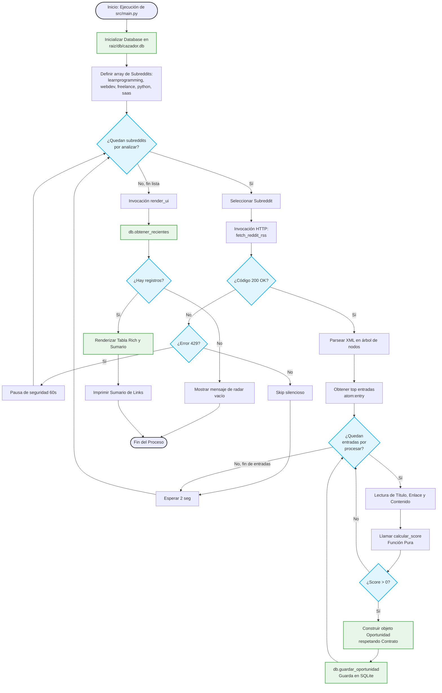

# Diagrama de Flujo: cazador-cli (Engine v1.2)

Este documento detalla el comportamiento algorítmico y lógico del script principal `src/main.py`, responsable de la técnica **Stealth RSS**, la detección semántica de **"Dolor de Usuario"** (Zero-Quota Mode) y la persistencia local vía SQLite.

## Algoritmo de Extracción y Análisis

## Leyenda y Aspectos Técnicos
- **Stealth RSS:** El consumo de XML vía `top.rss?t=week` permite capturar data validada orgánicamente sin requerir credenciales de API (Zero-Quota).
- **Funciones Puras:** El core analítico (`calcular_score`) opera sin mutaciones laterales, asegurando previsibilidad.
- **Persistencia Local:** La capa `database.py` gestiona SQLite resolviendo la ruta con `abspath(__file__)` garantizando una ejecución inmune a diferencias de pathing (CWD).
- **Protección de API:** El factor de retraso artificial (`time.sleep`) en loops y la gestión activa de errores HTTP 429 evitan la asfixia proactiva del bot en entornos de red exigentes.
